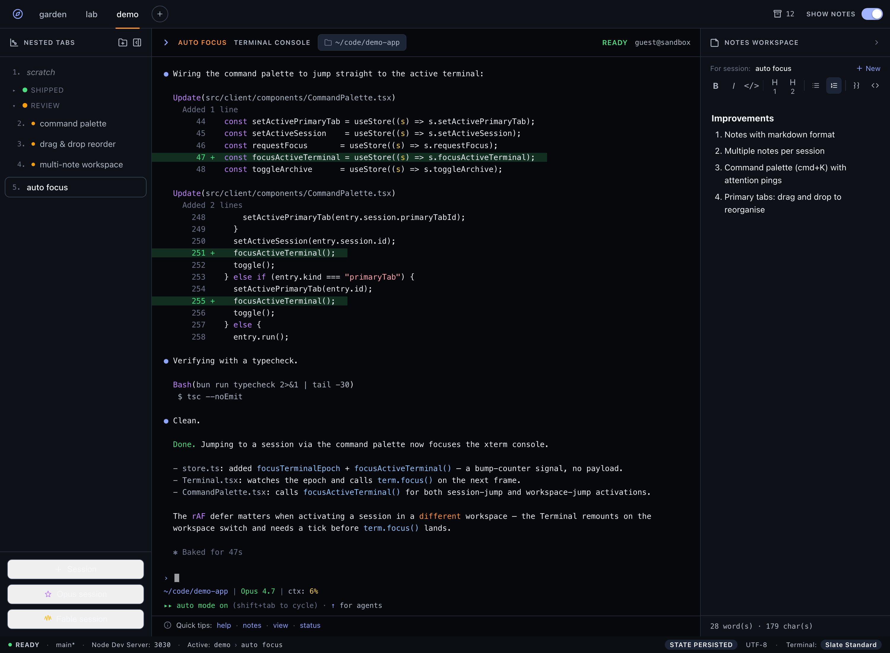

<h1 align="center">TabTerm</h1>

<p align="center">
  <em>A tabbed terminal workspace for your LAN — real shells, grouped sessions, live notes, every device in sync.</em>
</p>

<p align="center">
  <a href="#quick-start"></a>
  
  
  
  
</p>

<p align="center">
  
</p>

---

Open any device on your network in a browser and you get a **real, interactive
shell** — one PTY per session, organized into colored groups across multiple
workspaces, with a markdown notes pane sitting next to each terminal. Everything
persists to SQLite and syncs live across every connected client.

No login. No cloud. No external services. Just `bun start`.

> Terminals are real PTYs (`vim`, `htop`, `ssh`, `git` — whatever) backed by
> [GoTTY](https://github.com/sorenisanerd/gotty) subprocesses that TabTerm
> spawns and proxies. The browser never talks to GoTTY directly.

## Features

- 🖥️ **Real shells in the browser** — one GoTTY-backed PTY per session, rendered with xterm.js (auto-fit, auto-reconnect).
- 🗂️ **Nested workspaces** — primary tabs at the top, colored collapsible groups in the sidebar, drag-and-drop reordering.
- 📝 **Per-session markdown notes** — multiple notes per session, auto-saved, render alongside the terminal.
- ⌘ **Command palette** — `⌘K` to jump to any session or workspace; sessions waiting on Claude get a ping.
- 🔔 **Attention badges & desktop pings** — when a long-running agent finishes or needs you, the session lights up and the OS pops a notification.
- 🔁 **Live multi-device sync** — every mutation broadcasts over WebSocket; open the same layout on your desktop and laptop and stay in sync.
- 💾 **Persistent** — layout, groups, sessions, and notes live in SQLite (WAL); GoTTY processes are re-spawned automatically on restart.
- 🌗 **Light & dark** — themed terminal palettes that match the chrome.

## Quick start

```bash
bun install        # installs deps + downloads the GoTTY binary
bun run dev        # server + Vite client with hot reload
```

Then open the printed URL (default <http://localhost:3000>).

### Production

```bash
bun run build      # build the React SPA into dist/
bun start          # NODE_ENV=production: Bun serves the SPA + API on one port
```

## Requirements

- [Bun](https://bun.sh) ≥ 1.1
- GoTTY — fetched automatically via the `postinstall` script (`bun install`).

## Configuration

All configuration lives in a single JSON file. Every field is optional and falls
back to a sensible default.

- **Dev**: `config.sample.json` in the repo root (so local runs never touch your prod database).
- **Prod** (compiled binary or `NODE_ENV=production`): `~/.config/tabterm.json`.

| Key             | Default                  | Description                                                                                |
| --------------- | ------------------------ | ------------------------------------------------------------------------------------------ |
| `dbPath`        | `~/.config/tabterm.db`   | Path to the SQLite database.                                                               |
| `port`          | `3000`                   | HTTP + WebSocket server port.                                                              |
| `gottyBasePort` | `4001`                   | First port for dynamically-allocated GoTTY processes (one per session).                    |
| `gottyBin`      | bundled binary           | Path to the GoTTY binary.                                                                  |
| `sessionInit`   | _(none)_                 | Default honors your `$SHELL` (zsh or bash) with status/AI-startup hooks layered on. Set a path to use a custom bash rcfile, or `"off"` to launch a bare `$SHELL` with no injection. |
| `claudeCommand` | `claude`                 | Command launched for "Claude session". Use an absolute path if it's outside `$PATH`.       |

Paths support `~` expansion. Example `~/.config/tabterm.json`:

```json
{
  "dbPath": "~/.config/tabterm.db",
  "port": 8080,
  "gottyBasePort": 4001
}
```

## Architecture

```
┌──────────────────────────────────────────────────┐
│  Browser — React + Zustand + xterm.js            │
│  - App WS:  session/group/note mutations         │
│  - PTY WS:  /gotty/ws/:sessionId (per terminal)  │
└───────────────────┬──────────────────────────────┘
                    │ HTTP + WS (one port)
┌───────────────────▼──────────────────────────────┐
│  Bun server (src/server/)                        │
│  - Serves the SPA + REST /api/*                  │
│  - App WS: broadcasts mutations to all clients   │
│  - PTY WS proxy: /gotty/ws/:id → GoTTY process   │
│  - Process manager: spawn/kill GoTTY per session │
└──────┬────────────────────┬──────────────────────┘
       │ bun:sqlite         │ spawn (one per session)
┌──────▼──────┐   ┌─────────▼───────┐
│  state.db   │   │ GoTTY → bash    │  ...
│  (WAL)      │   │ (real PTY)      │
└─────────────┘   └─────────────────┘
```

The browser never connects to GoTTY directly — every PTY stream is proxied
through the Bun server. App state (layout, groups, notes) lives in SQLite; the
terminal scrollback buffer is owned by GoTTY and is not persisted.

## Tech stack

| Layer            | Technology                                          |
| ---------------- | --------------------------------------------------- |
| Runtime          | Bun (HTTP, WS, SQLite, process management)          |
| Frontend         | React 18 + TypeScript, Vite                         |
| Terminal         | xterm.js v5 + `@xterm/addon-fit`                    |
| PTY backend      | GoTTY (one subprocess per session)                  |
| Notes editor     | Tiptap (markdown round-trip)                        |
| State (client)   | Zustand                                             |
| State (server)   | `bun:sqlite` (WAL)                                  |
| Styling          | Tailwind CSS v4                                     |

## Project layout

```
src/
├── server/        # Bun.serve entry, SQLite, routes, app WS, GoTTY manager, config
└── client/        # React SPA: store, WS client, components (Sidebar, Terminal, NotesPanel)
scripts/           # install-gotty, embed-asset generation, screenshot mockup
config.sample.json # dev config
```

## Scripts

| Command             | Description                              |
| ------------------- | ---------------------------------------- |
| `bun run dev`       | Server + client with hot reload          |
| `bun run build`     | Build the SPA into `dist/`               |
| `bun start`         | Run the production server                |
| `bun run typecheck` | `tsc --noEmit`                           |

## Scope & trust model

TabTerm assumes a **LAN-trust model**: there is no authentication or user
accounts — anyone who can reach the port gets a shell. Run it only on trusted
networks. It is a local/LAN tool, not a cloud service.

## License

MIT — see [LICENSE](LICENSE).
